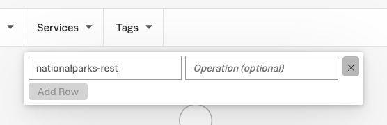
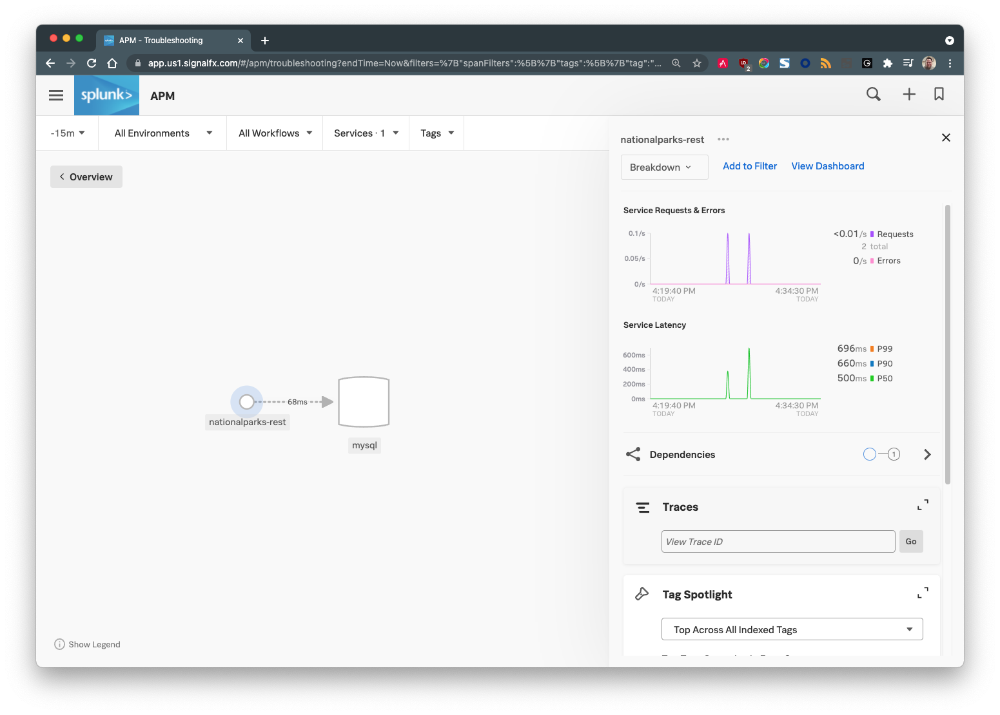
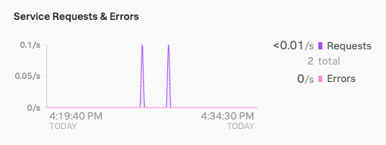
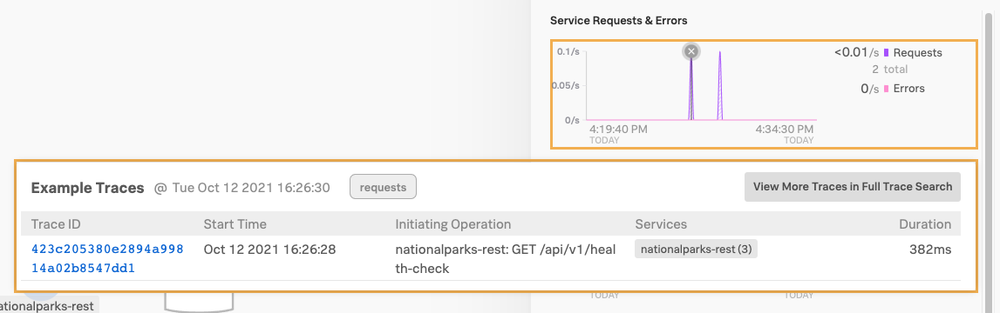
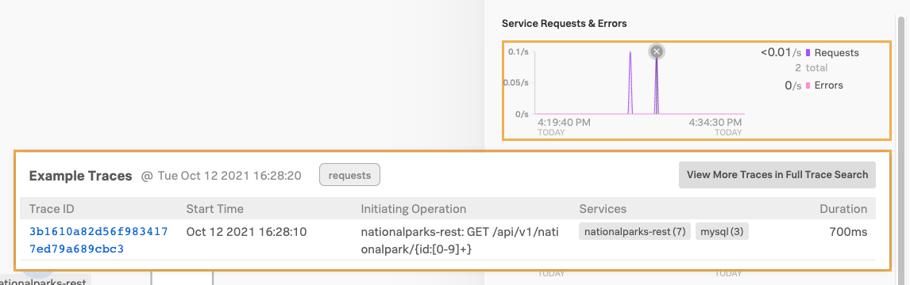
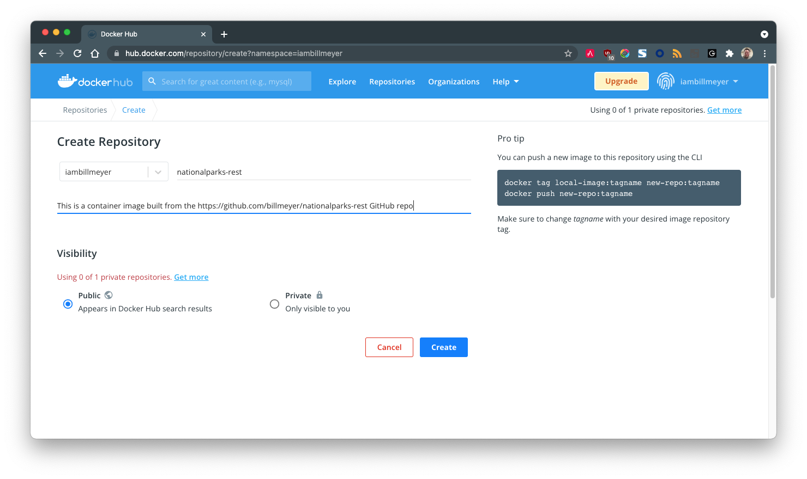
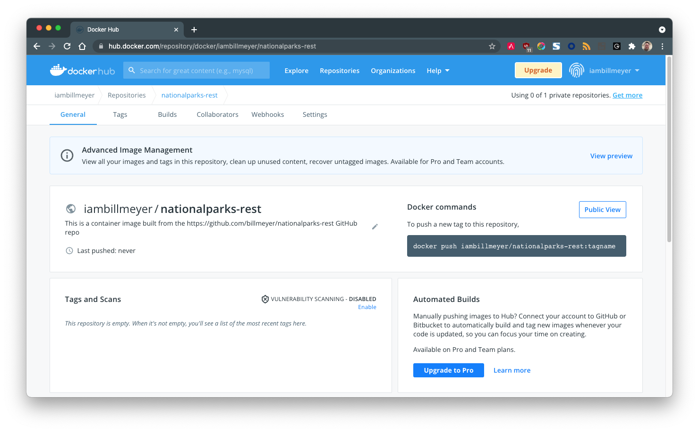
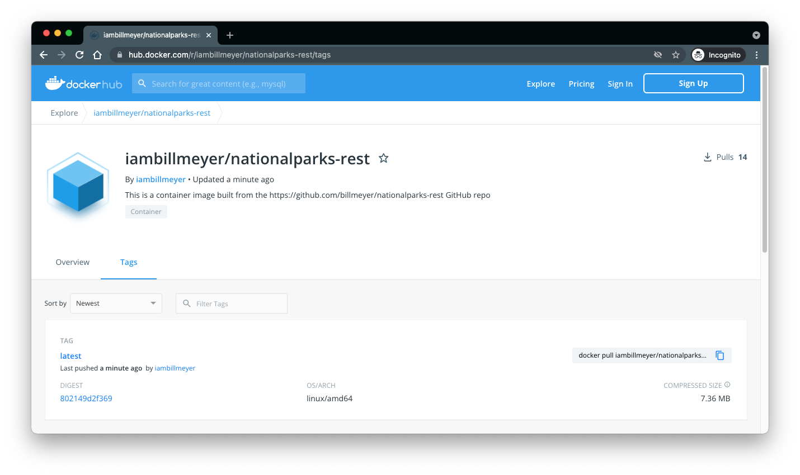

# National Parks - REST Api

This project represents a web services (written in Go) that can be used to make RESTful web services to lookup National Park data stored in a MySQL database.

It utilizes a MySQL database that can be found at [https://github.com/billmeyer/nationalparks-mysql]() and is a dependency.

## Setup

1. Follow the instructions at [https://github.com/billmeyer/nationalparks-mysql]() for installing and running the MySQL database that this service uses.  The mysql instance can be run as either a Docker container or deployed to Kubernetes.

    > NOTE: Make note of the IP Address the MySQL Server instance.  It will be used below.

2. Next, clone the repository

    ```bash
    $ git clone https://github.com/billmeyer/nationalparks-rest.git
    ```

3. Change your working directory into the project directory

    ```bash
    $ cd nationalparks-rest
    ```

4. Edit `config.sh` and modify the entries to conform to your specific deployment of MySQL and this service.  For example, when running the service locally, the `BACKEND_URL` might be `http://localhost:8080`.  When running in a Docker container or on Kubernetes, it would be reachable via a different IP address/port combination.

## Run

> NOTE: This service was developed using Go version 1.17.1.  Be sure a recent version has been downloaded from [https://golang.org/dl/]() and that the `go` executable is the system path.

1. Source your `config.sh` to be sure your environment variables are set properly:

   ```bash
   $ source config.sh
   ```

2. From the `nationalparks-rest` directory, run a local instance of the server using:

   ```bash
   $ go run cmd/main/server.go 
{"message":"National Parks REST API Service","severity":"info","timestamp":"2021-10-12T16:24:27.375633-05:00"}
{"message":"Using MySQL instance at 192.168.3.230:3306","severity":"info","timestamp":"2021-10-12T16:24:27.375871-05:00"}
{"message":"Server started at 0.0.0.0:8080","severity":"info","timestamp":"2021-10-12T16:24:27.376107-05:00"}
   ```
   
   The startup output should reflect the MySQL instance you have configured and the service is listening on interface 0.0.0.0, port 8080.

3. Confirm the Health Check endpoint is reachable by running the `health-check.sh` script:

   ```bash
   $ ./health-check.sh
   HTTP/1.1 200 OK
   Access-Control-Expose-Headers: Server-Timing
   Content-Type: application/json
   Server-Timing: traceparent;desc="00-423c205380e2894a99814a02b8547dd1-c032884227869afb-01"
   Vary: Origin
   Date: Tue, 12 Oct 2021 21:26:29 GMT
   Content-Length: 24
   
   "API is up and running"
   ```

   If you see the `"API is up and running"` result, the service is reachable.

4. Confirm the service can communicate with the MySQL instance by running the `get-a-park.sh` script:

   ```bash
   $ ./get-a-park.sh
   HTTP/1.1 200 OK
   Access-Control-Expose-Headers: Server-Timing
   Content-Type: application/json
   Server-Timing: traceparent;desc="00-3b1610a82d56f9834177ed79a689cbc3-3b6e084c58c396e8-01"
   Vary: Origin
   Date: Tue, 12 Oct 2021 21:28:10 GMT
   Content-Length: 250
   {"id":1,"location_num":"ADAM","location_name":"Adams National Historical Park","address":"135 Adams Street","city":"Quincy","state":"MA","zip_code":2169,"phone_num":"(617) 770-1175","fax_num":"(617) 472-7562","latitude":42.2564,"longitude":-71.0112}
   ```

### Review traces

1. Both of the above tests will invoke the REST api which will, in turn, produce traces that are sent to Splunk Observability. Confirm these traces are arriving in Splunk Observability by visiting [https://app.us1.signalfx.com/#/apm/troubleshooting]().

2. Click on the **Services** dropdown and add a service named `nationalparks-rest`:

   

   Dismiss the filter and you should see a single view of the `nationalparks-rest` service and it's dependency on the `mysql` service:

   

3. Take a closer look at the two purple blips on the **Service Requests & Errors** chart:

   

4. Hover over the first blip and click the peak on the chart:

   

   This should reveal the Health Check test we ran first in the prior section.  You'll notice the trace ID (`423c205380e2894a99814a02b8547dd1` in this example) matches the trace ID that was returned from the service call as a `Server-Timing` HTTP Header: 

   ```
   Server-Timing: traceparent;desc="00-423c205380e2894a99814a02b8547dd1-c032884227869afb-01"
   ```

5. Likewise, clicking on the peak of the second blip:

   

   reveals the trace for the second test of running the `get-a-park.sh` script.

## Dockerize

To build a Docker image for this service, a `Dockerfile` is provided.  It utilizes a two-stage build process with the first phase adding the static/non-changing elements to a base `golang:alpine` image.  The source code is then added to the image and a deployable image is built using only the resulting native executable (without the Go tooling added) so that the resulting deployment image is very small.

1. To build the container image, simply run:

   ```bash
   $ ./build-image.sh
   [+] Building 37.8s (20/20) FINISHED
   => [internal] load build definition from Dockerfile
   => => transferring dockerfile: 710B
   => [internal] load .dockerignore
   => => transferring context: 2B
   => [internal] load metadata for docker.io/library/alpine:latest
   => [internal] load metadata for docker.io/library/golang:alpine
   => [auth] sharing credentials for imbm.io
   => [auth] library/alpine:pull token for registry-1.docker.io
   => [auth] library/golang:pull token for registry-1.docker.io
   => [build 1/9] FROM docker.io/library/golang:alpine@sha256:c2335038e2230960f81cb2f9f1fc5eca45e23b765de1848c7bbfaebcfd32d90d
   => => resolve docker.io/library/golang:alpine@sha256:c2335038e2230960f81cb2f9f1fc5eca45e23b765de1848c7bbfaebcfd32d90d
   => => sha256:31adcdaf11c89113a810db23d523e549d634d7de695a72b0ce98a1f912101262 281.51kB / 281.51kB
   => => sha256:b8b176561691ea11cfe541f3ee363a3aa67e3649eb3273bea62ebeea713eaecd 154B / 154B
   => => sha256:c2335038e2230960f81cb2f9f1fc5eca45e23b765de1848c7bbfaebcfd32d90d 1.65kB / 1.65kB
   => => sha256:5ce2785c82a96349131913879a603fc44d9c10d438f61bba84ee6a1ef03f6c6f 1.36kB / 1.36kB
   => => sha256:35cd8c8897b1e3ffb330ad7271ff29023e7f82c8a2bd5dd6eb65b6547c130494 5.08kB / 5.08kB
   => => sha256:a0d0a0d46f8b52473982a3c466318f479767577551a53ffc9074c9fa7035982e 2.81MB / 2.81MB
   => => sha256:a9757cebd49be0f77e85271da8fcd9dd0dc5d25892ffd00f6b2062cf220e9928 110.10MB / 110.10MB
   => => extracting sha256:a0d0a0d46f8b52473982a3c466318f479767577551a53ffc9074c9fa7035982e
   => => sha256:aab139f4bc5a044e5aa8ec76e5382ab75f00bb681e842237024d91f75b5dddf3 0B / 157B
   => => extracting sha256:31adcdaf11c89113a810db23d523e549d634d7de695a72b0ce98a1f912101262
   => => extracting sha256:b8b176561691ea11cfe541f3ee363a3aa67e3649eb3273bea62ebeea713eaecd
   => => extracting sha256:a9757cebd49be0f77e85271da8fcd9dd0dc5d25892ffd00f6b2062cf220e9928
   => => extracting sha256:aab139f4bc5a044e5aa8ec76e5382ab75f00bb681e842237024d91f75b5dddf3
   => [stage-1 1/3] FROM docker.io/library/alpine:latest@sha256:e1c082e3d3c45cccac829840a25941e679c25d438cc8412c2fa221cf1a824e6a
   => => resolve docker.io/library/alpine:latest@sha256:e1c082e3d3c45cccac829840a25941e679c25d438cc8412c2fa221cf1a824e6a
   => => sha256:e1c082e3d3c45cccac829840a25941e679c25d438cc8412c2fa221cf1a824e6a 1.64kB / 1.64kB
   => => sha256:69704ef328d05a9f806b6b8502915e6a0a4faa4d72018dc42343f511490daf8a 528B / 528B
   => => sha256:14119a10abf4669e8cdbdff324a9f9605d99697215a0d21c360fe8dfa8471bab 1.47kB / 1.47kB
   => => sha256:a0d0a0d46f8b52473982a3c466318f479767577551a53ffc9074c9fa7035982e 2.81MB / 2.81MB
   => => extracting sha256:a0d0a0d46f8b52473982a3c466318f479767577551a53ffc9074c9fa7035982e
   => [internal] load build context
   => => transferring context: 1.75MB
   => [build 2/9] RUN apk update &&     apk add curl             git             bash     rm -rf /var/cache/apk/*
   => [build 3/9] WORKDIR /go/src/nationalparks-rest
   => [build 4/9] COPY go.mod ./
   => [build 5/9] COPY go.sum ./
   => [build 6/9] RUN go mod download
   => [build 7/9] RUN go mod verify
   => [build 8/9] COPY . ./
   => [build 9/9] RUN go build cmd/main/server.go
   => [stage-1 2/3] COPY --from=build /go/src/nationalparks-rest/server /nationalparks-rest
   => exporting to image
   => => exporting layers
   => => writing image sha256:081b3ee3c200afb3e54ad2de9da541b17db4951c23e1973ce6a848fe49c34fa1
   => => naming to docker.io/library/nationalparks-rest:1634135222
   ```

2. Running `docker images` shows the resulting image is very small

   ```bash
   $ docker images
   REPOSITORY           TAG          IMAGE ID       CREATED         SIZE
   nationalparks-rest   1634135222   081b3ee3c200   2 minutes ago   14.8MB
   nationalparks-rest   latest       081b3ee3c200   2 minutes ago   14.8MB
   ```

3. To run a docker instance of the National Parks REST API, use the `run-docker-instance.sh` script:

   ```bash
   $ ./run-docker-instance.sh
   {"message":"National Parks REST API Service","severity":"info","timestamp":"2021-10-13T14:30:11.286752Z"}
   {"message":"Using MySQL instance at 192.168.3.230:3306","severity":"info","timestamp":"2021-10-13T14:30:11.2869382Z"}
   {"message":"Server started at 0.0.0.0:8080","severity":"info","timestamp":"2021-10-13T14:30:11.2872608Z"}
   ```
   
4. Confirm the service is working and can talk to MySQL:

   ```bash
   $ curl --include http://0.0.0.0:8080/api/v1/nationalpark/1
   ```
## Kubernetes

> NOTE: To deploy the National Parks RESTful Web Service to Kubernetes, the container image needs to be available from a Docker Registry- either Docker Hub or your own private repo.  For this example, we will use Docker Hub but you must have your own Docker Hub account before proceeding.

### Push the Docker image to Docker Hub

1. Sign into your Docker Hub account and click the **Create Repository** button.
2. Name the repository `nationalparks-rest`:

   

   Leave the **Visibility** set to **Public**.
3. Click **Create**.
4. Take note of the Docker command that will be used to push images to the new repo as shown in this screen shot:

   

5. Next, push the image to the newly created repo on Docker Hub by using the `tag-and-push.sh` script.

   > NOTE: Be sure to pass _your_ Docker Hub username to the `tag-and-push.sh` script.

   ```bash
   $ ./tag-and-push.sh iambillmeyer
   The push refers to repository [docker.io/iambillmeyer/nationalparks-rest]
   d761898d5b26: Pushed
   e2eb06d8af82: Layer already exists
   latest: digest: sha256:802149d2f3694c9dbbbe6a867ebfa12c80427f4c19a773d4288a595e60a08012 size: 739
   ```

6. You can confirm the image was pushed successfully by opening the repo in Docker Hub:

   Navigate to [https://hub.docker.com/r/USERNAME/nationalparks-rest/tags]().

   

### Deploy to Kubernetes

The scripts for deployment to Kubernetes can be found in the project's `/kubernetes` subdirectory.

1. Start by updating the deployment to use the container image you created.  Edit `/kubernetes/03_deployment.yaml`.  Around line line 52, replace:

   ```yaml
             image: iambillmeyer/nationalparks-rest
   ```

   with the name of your Docker Hub Username:

   ```yaml
             image: <your Docker Hub Username>/nationalparks-rest
   ```
   
   Save and exit.

2. Create the `nationalparks` namespace into which everything will be deployed:

   ```bash
   $ kubectl apply -f 01_namespace.yaml
   namespace/nationalparks created
   ```

3. Create a secret named `splunk-access` that will contain key-value pairs for both the SPLUNK_ACCESS_TOKEN and SPLUNK_REALM values needed by the service:

   ```bash
   $ ./create-secrets.sh
   secret/splunk-access created
   ```

4. Apply the Kubernetes manifests:

   ```bash
   $ cd ./kubernetes
   $ kubectl apply -f .
   namespace/nationalparks unchanged
   service/nationalparks-rest created
   deployment.apps/nationalparks-rest created
   service/nationalparks-rest-external created
   ```

5. Confirm the pod deployment:

   ```bash
   $ kubectl get pods -n nationalparks
   NAME                                  READY   STATUS    RESTARTS   AGE
   nationalparks-rest-56684b4779-qqfh5   1/1     Running   0          21s
   ```

### Verify Kubernetes Deployment

1. Retrieve the **ClusterIP** ip address for the `nationalparks-rest` pod:

   ```bash
   $ kubectl get svc | grep nationalparks-rest | grep ClusterIP
   nationalparks-rest            ClusterIP      10.100.57.92     <none>          8080/TCP         137m
   ```
   
2. Install a "curl" pod in the namespace that we can use to inspect the service:

   ```bash
   $ kubectl run --generator=run-pod/v1 -i --tty busybox --image=radial/busyboxplus:curl --restart=Never -- sh
   If you don't see a command prompt, try pressing enter.
   [ root@busybox:/ ]$
   ```
   
3. Curl the rest endpoint using the IP address and Port number from Step 1:

   ```bash
   [ root@curl:/ ]$ curl http://10.100.57.92:8080/api/v1/health-check
   "API is up and running"
   ```
   
   You should see the familiar `"API is up and running"` response from the service.

   Likewise, querying a single National Park entry will confirm access to MySQL:

   ```bash
   [ root@curl:/ ]$ curl http://10.100.57.92:8080/api/v1/nationalpark/1
   {"id":1,"location_num":"ADAM","location_name":"Adams National Historical Park","address":"135 Adams Street","city":"Quincy","state":"MA","zip_code":2169,"phone_num":"(617) 770-1175","fax_num":"(617) 472-7562","latitude":42.2564,"longitude":-71.0112}
   ```

